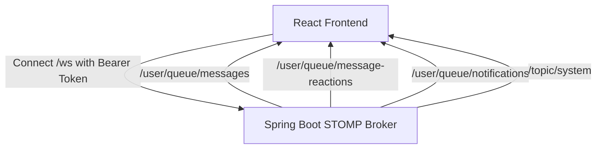

# 🌐 Social Media & Dating Platform — Frontend (React + Vite)

[](https://react.dev/)
[](https://vitejs.dev/)
[](https://tailwindcss.com/)
[](https://www.framer.com/motion/)
[](https://stomp-js.github.io/)
[](https://github.com/pmndrs/zustand)
[]()

A high-performance, production-grade social media frontend built with **React 19**, **Vite**, **Tailwind CSS**, and **Framer Motion**. It features a modern **Instagram & Facebook hybrid UI/UX** with real-time **STOMP WebSocket** communication, Tinder-style Dating swipe decks, full-screen vertical Reels, interactive Stories, and an animated 3D emoji reaction system.

---

## 📑 Table of Contents

- [✨ Key Features](#-key-features)
  - [1. Feed & Post Interaction](#1-feed--post-interaction)
  - [2. Reaction & Comment System](#2-reaction--comment-system)
  - [3. Reels & Short Videos](#3-reels--short-videos)
  - [4. Instagram Stories](#4-instagram-stories)
  - [5. Real-Time Chat & Messaging](#5-real-time-chat--messaging)
  - [6. Dating & Matchmaking Deck](#6-dating--matchmaking-deck)
  - [7. Search & Explore Media Grid](#7-search--explore-media-grid)
  - [8. User Profile & Social Graph](#8-user-profile--social-graph)
  - [9. Real-Time Notifications](#9-real-time-notifications)
  - [10. Administration & Moderation](#10-administration--moderation)
- [🛠️ Tech Stack & Architecture](#️-tech-stack--architecture)
- [📂 Project Directory Structure](#-project-directory-structure)
- [⚙️ Environment Variables](#️-environment-variables)
- [🚀 Quick Start & Installation](#-quick-start--installation)
- [📡 WebSocket & STOMP Protocol](#-websocket--stomp-protocol)
- [🧩 State Management & Caching](#-state-management--caching)
- [🛡️ Security & Route Protection](#️-security--route-protection)

---

## ✨ Key Features

### 1. Feed & Post Interaction
* **Instagram-Inspired Layout**: Clean multi-media carousel and adaptive grid cards.
* **Double-Tap / Click to Heart**: Bouncing glowing heart animation in the center of the image with automatic `LOVE` reaction.
* **Action Bar Counters**: Real-time numerical badges displayed directly next to Like (`❤️ 14`) and Comment (`💬 22`) action icons.
* **Floating Media Stats Pill**: Bottom-corner glassmorphism badge (`❤️ 14 | 💬 22`) overlay on post images and videos.
* **Rich Text Formatting**: Live hashtag (`#hashtag`) highlighting and user tag (`@username`) parsing.
* **Save & Bookmark**: Instant post saving with a dedicated `/saved-posts` library.

### 2. Reaction & Comment System
* **3D Animated Reaction Picker**: Floating glass dock featuring 6 Fluent 3D animated emojis (**Like 👍, Love ❤️, Haha 😆, Wow 😮, Sad 😢, Angry 😡**) with spring scale hover zoom (`1.45x`) and dark glass tooltips.
* **Optimistic Counter Updates**: Instant `+1` / `-1` visual transitions when reacting, unreacting, or switching emotion.
* **Reacted Users Breakdown Modal**: Tabbed filter dialog displaying exact emotion counts and per-user reaction badges.
* **Threaded Nested Replies**: Comment bubbles with author badges (`Tác giả`), collapsible reply branches (`↳ View 3 replies`), and inline editing.
* **Quick Emoji Reaction Bar**: One-click quick emoji insertion bar (`❤️ 🙌 🔥 👏 😍 😂 😮 💯`) above sticky comment input.

### 3. Reels & Short Videos
* **Full-Screen Vertical Video Player**: Immersive viewport-fitted video feed with swipe/scroll snapping.
* **Interactive Media Controls**: Tap-to-pause, volume/mute toggles, floating like counter, and share shortcuts.
* **Slide-Up Comment Drawer**: Integrated slide-up sheet supporting nested comments without losing video playback context.

### 4. Instagram Stories
* **Story Bar with Gradient Rings**: Unread colorful rings and user avatar status.
* **Full-Featured Story Viewer**: Timed auto-progression bar, tap-to-skip, hold-to-pause, direct story replies, and author viewer analytics.
* **Media Creator**: Multi-format image/video upload with custom text captions and privacy settings.

### 5. Real-Time Chat & Messaging
* **STOMP WebSocket Integration**: Instant point-to-point delivery over `/user/queue/messages`.
* **Rich Chat UI**: Message delivery ticks, typing indicators, image sharing, unread counters, and message emoji reactions.
* **Active Status & Conversation Search**: Real-time online/offline presence tracking and conversation filters.

### 6. Dating & Matchmaking Deck
* **100% Viewport Zero-Scroll Deck**: Tinder-style swipeable card deck with swipe gestures and keyboard arrow triggers (`←` Pass, `→` Like).
* **Celebration Match Modal**: Dual-avatar animation with confetti celebration upon mutual like (`isMatch: true`).
* **Matches Management Page**: Dedicated `/dating/matches` tab with direct messaging triggers and unmatch capabilities.
* **Dating Profile & Preference Filters**: Age range, location distance, gender preference, bio, and lifestyle tags.

### 7. Search & Explore Media Grid
* **Instagram Explore Grid**: 3-column square media layout with video badges and multiple-item indicators.
* **Hover Interaction Overlay**: Semi-transparent dark overlay displaying like and comment metrics (`❤️ 42  💬 8`).
* **Multi-Tab Search**: Instant query execution across Users, Posts, and Trending Hashtags.

### 8. User Profile & Social Graph
* **Comprehensive Profile Hub**: 3-column media grid tabs (**Posts, Reels, Saved, Friends**).
* **Detailed Bio & Social Links**: City, country, education, occupation, phone, website, and external socials.
* **Mutual Friends Preview**: Automatic calculation and preview of mutual connections.
* **Relationship Management**: Send friend request, cancel, accept, reject, unfriend, and user blocking.

### 9. Real-Time Notifications
* **STOMP Notification Listener**: Instant notification push over `/user/queue/notifications`.
* **Interactive Dropdown**: Tabbed filter (All, Unread), relative time stamps, hover dismiss `(X)` deletion, and mark all as read.

### 10. Administration & Moderation
* **Admin Dashboard (`/admin`)**: User moderation, post deletion, violation report review (Approve/Reject), and platform analytics.

---

## 🛠️ Tech Stack & Architecture

| Technology | Purpose |
| :--- | :--- |
| **React 19.2** | Modern UI component rendering with latest concurrent features |
| **Vite 8.2** | Next-generation frontend tooling and ultra-fast HMR bundler |
| **Tailwind CSS 3.4** | Utility-first responsive CSS framework with custom glassmorphism |
| **Framer Motion 13.0** | Fluid spring physics, layout animations, and modal transitions |
| **Zustand 5.0** | Lightweight, decoupled global state management (WebSocket client store) |
| **TanStack React Query 5.101** | Server state caching, pagination, and data synchronization |
| **STOMP.js 7.3 & SockJS 1.6** | Dual-mode enterprise WebSocket messaging with HTTP fallback |
| **Axios 1.19** | HTTP client with automated Bearer token injection and error interceptors |
| **Lucide React 1.31** | Clean, lightweight icon suite |
| **React Hot Toast 2.6** | Non-intrusive notification toasts |
| **React Router DOM 7.18** | Client-side routing with role-based protected guards |

---

## 📂 Project Directory Structure

```
social-fe/
├── public/                     # Static assets and favicon
├── src/
│   ├── api/
│   │   └── axiosClient.js      # Central Axios instance with JWT interceptors
│   ├── components/
│   │   ├── common/             # Reusable UI widgets (Modals, Buttons, Loaders)
│   │   ├── dating/             # Dating card deck, MatchModal, discovery cards
│   │   ├── friend/             # Friend suggestions, pending requests
│   │   ├── layout/             # InstagramSidebar, MobileHeader, Navigation
│   │   ├── message/            # Chat bubbles, conversation lists, input box
│   │   ├── notification/       # NotificationDropdown and alert badges
│   │   ├── post/               # PostCard, ReactionPicker, CommentSection, ReactedUsersModal
│   │   ├── reel/               # ReelCard, ReelCommentDrawer, ReelVideoPlayer
│   │   ├── story/              # StoryBar, StoryViewerModal, StoryCreator
│   │   └── ui/                 # Skeleton loaders, Glass containers
│   ├── contexts/
│   │   ├── AuthContext.jsx     # Authentication status, token lifecycle
│   │   └── UserContext.jsx     # Current user profile and global state
│   ├── pages/
│   │   ├── HomePage.jsx        # Main feed and trending sidebar
│   │   ├── SearchPage.jsx      # Explore media grid and search engine
│   │   ├── ReelsPage.jsx       # Vertical full-screen short video player
│   │   ├── MessagesPage.jsx    # Real-time WebSocket messaging center
│   │   ├── DatingPage.jsx      # Dating discovery swipe interface
│   │   ├── DatingMatchesPage.jsx # Matched connections list
│   │   ├── ProfilePage.jsx     # User profile, 3-column media tabs
│   │   ├── SavedPostsPage.jsx  # Bookmarked posts collection
│   │   └── AdminPage.jsx       # Platform moderation and report management
│   ├── services/               # Modular API service layer (Post, Dating, Chat, etc.)
│   ├── stores/
│   │   └── useWebSocketStore.js # Zustand STOMP WebSocket connection store
│   ├── utils/                  # Date formatting, token decoder, media helpers
│   ├── App.jsx                 # Route definitions and application shell
│   ├── main.jsx                # Application entry point
│   └── index.css               # Tailwind CSS imports and global styles
├── package.json
├── tailwind.config.js
└── vite.config.js
```

---

## ⚙️ Environment Variables

Create a `.env` file in the root of `social-fe/` with the following variables:

```env
# Backend API Base URL
VITE_API_URL=http://localhost:8080/api

# WebSocket & STOMP Endpoint
VITE_WS_URL=http://localhost:8080/ws
```

---

## 🚀 Quick Start & Installation

### 1. Prerequisites
* **Node.js**: `v18.0.0` or higher
* **Package Manager**: `npm` (v9+) or `yarn` / `pnpm`

### 2. Installation
Clone the repository and install dependencies:

```bash
# Navigate to the frontend project directory
cd social-fe/social-fe

# Install required npm packages
npm install
```

### 3. Start Development Server
Run the local Vite development server with Hot Module Replacement (HMR):

```bash
npm run dev
```
The application will be accessible at `http://localhost:5173`.

### 4. Build for Production
Compile and optimize assets for deployment:

```bash
npm run build
```
Production output files will be generated in the `dist/` folder.

### 5. Preview Production Build
```bash
npm run preview
```

---

## 📡 WebSocket & STOMP Protocol

Real-time features are powered by `@stomp/stompjs` and `sockjs-client` managed via `useWebSocketStore.js`:



### Subscribed Destinations:
* `/user/queue/messages`: Incoming private chat messages.
* `/user/queue/message-reactions`: Real-time reactions on chat messages.
* `/user/queue/notifications`: Push alerts for Likes, Comments, Friend Requests, and Matches.
* `/topic/system`: Platform broadcast announcements.

---

## 🧩 State Management & Caching

1. **Authentication & User Profile**: Centralized in `AuthContext` and `UserContext` with automatic local storage token synchronization and Axios request interceptors.
2. **WebSocket & Chat Channels**: Managed in `useWebSocketStore` (Zustand) with auto-reconnect backoff algorithm (`reconnectDelay: 5000ms`).
3. **Data Fetching & Infinite Scroll**: Powered by `postService` and TanStack Query for caching and pagination.

---

## 🛡️ Security & Route Protection

* **Protected Routes (`ProtectedRoute`)**: Restricts access to authenticated users possessing valid JWT tokens; redirects unauthenticated visitors to `/login`.
* **Admin Guard (`AdminRoute`)**: Enforces `ROLE_ADMIN` authority before rendering `/admin` moderation pages.
* **Automatic Token Interceptor**: Injects `Authorization: Bearer <token>` on all outgoing HTTP requests and STOMP connect headers.

---

## 📄 License

This project is licensed under the **MIT License**. Feel free to use, modify, and distribute.
